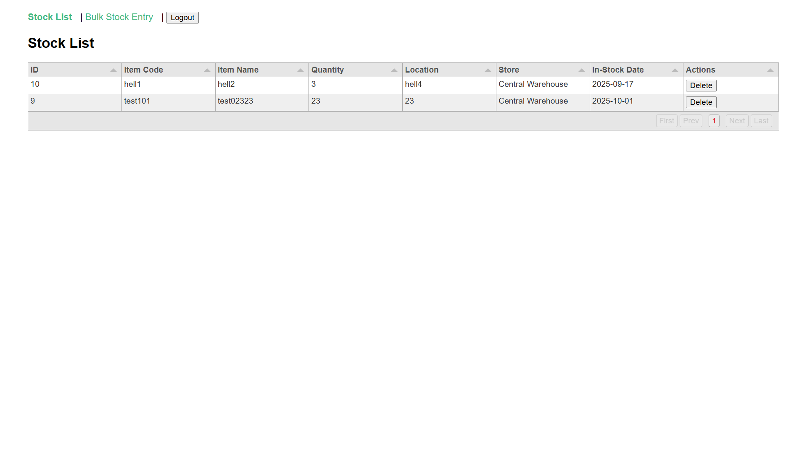
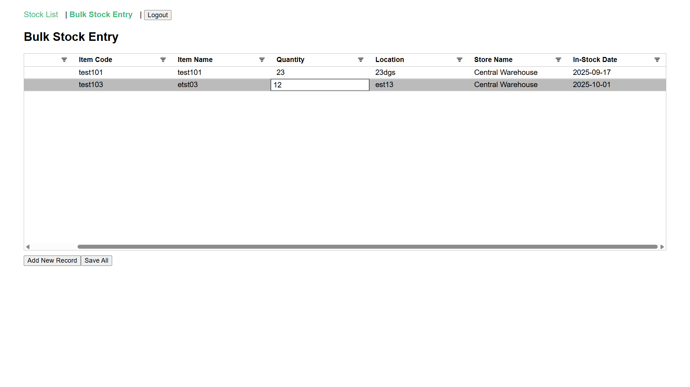

# 📦 Stock Management System (Laravel + Vue 3)


A simple stock management system built with **Laravel (API backend)** and **Vue 3 (frontend)**.  
It allows CRUD operations on stock items, bulk insert with AG Grid, dropdowns for store selection, and date picker support for in-stock dates.

---

## 🚀 Features

- 🔐 User Authentication (Laravel Passport)  
- 📊 Stock listing with pagination (Tabulator / AG Grid)  
- ➕ Add New Stock with inline grid editing  
- 📥 Bulk Insert / Save All stocks at once  
- 🏬 Store dropdown for stock location  
- 📅 Date picker for in-stock date  
- 🗑️ Delete stock records  
- ✅ Client-side & server-side validation  
- ⚡ Laravel API + Vue frontend integration  

---

## 🖼️ Screenshots

### Login Page


### Stock List (Tabulator)


### Bulk Insert (AG Grid)


---

## 🛠️ Tech Stack

**Backend (API)**  
- Laravel 10  
- Laravel Passport (Authentication)   
- MySQL  

**Frontend**  
- Vue 3 (Composition API)  
- AG Grid Vue 3  
- Tabulator.js  
- Axios

---

## 🔧 Installation

### 1. Clone Repository
```bash
git clone https://github.com/your-username/stock-management.git
cd stock-management
```

### 2. Backend Setup (Laravel API)
```bash
cd backend
cp .env.example .env
composer install
php artisan key:generate
php artisan migrate --seed
php artisan passport:install
php artisan serve
```
### 3. Frontend Setup (Vue 3)
```bash
cd frontend
cp .env.example .env
npm install
npm run dev
```

### Default Laravel User
```bash
Email: admin@example.com  
Password: password 
```

